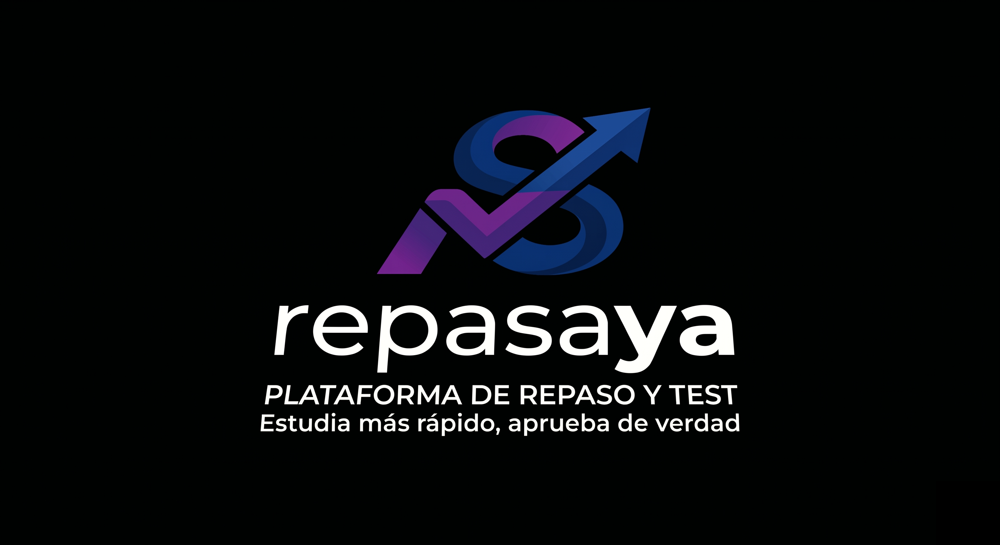

<div align="center">
  
</div>

# repasaYA

> Material interactivo de repaso para las asignaturas de la carrera — todo en un sitio.

## Contenido

- **Tipo test** — preguntas con 4 opciones, corrección automática y resultados por tema
- **Verdadero / Falso** — afirmaciones para repasar conceptos clave
- **Flashcards** — tarjetas de memoria con anverso/reverso
- **Banco de preguntas** — recopilación filtrable de todas las preguntas
- **Exámenes reales** — PDFs de convocatorias anteriores
- **Apuntes en PDF** — temas completos o resúmenes
- **Definiciones y glosarios** — términos importantes con su explicación

## Estructura

```
repasaYA/
├── tipo-test/          ← una carpeta por asignatura dentro
├── verdadero-falso/
├── flashcards/
├── examenes/
├── apuntes/
└── glosarios/
```

## Cómo contribuir

Si tienes preguntas de examen, tipo test o flashcards de alguna asignatura, abre una issue o un PR.

---

Si esto te ha servido, sígueme en GitHub → **[github.com/jxliian](https://github.com/jxliian)** ⭐
