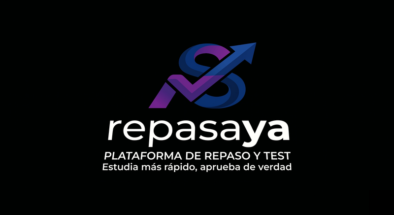

<div align="center">
  

  <p><strong>Material interactivo de repaso para el Doble Grado ADE + Informática — todo en un sitio.</strong></p>

  <p>
    <a href="https://jxliian.github.io/repasaYA/"><strong>🔗 Abrir repasaYA</strong></a>
    ·
    <a href="https://github.com/jxliian/repasaYA/issues/new">Solicitar asignatura</a>
  </p>

  <p>
    
    
    
  </p>
</div>

---

## ¿Qué es?

**repasaYA** es un sitio web estático que reúne tests interactivos, preguntas de verdadero/falso, flashcards, glosarios y apuntes en PDF de las asignaturas de la carrera. Todo funciona en el navegador: corrección automática, resultados por tema, buscador y modo claro/oscuro. **Gratis, sin registro y sin anuncios.**

## Asignaturas

El catálogo se define en [`src/data/subjects.ts`](src/data/subjects.ts) y se agrupa en un carrusel dual: **ADE / Economía** vs **Ingeniería**.

### 🟣 ADE / Economía

| Asignatura | Contenido |
|---|---|
| 🇪🇸 **Economía Española** | Tests por tema, banco de preguntas, flashcards y exámenes oficiales · +300 preguntas · 9 temas *(repo externo)* |
| 👥 **Recursos Humanos** | 312 V/F con justificación + tipo test · 11 bloques · exámenes |
| 🏢 **Organización de Empresas** | 397 preguntas tipo test · 128 flashcards · 20 bloques · guía + modo "secreto" |
| ⚙️ **Dirección de Operaciones I** | 80 V/F con justificación · 7 temas |
| 📈 **Análisis de Estados Financieros** | 38 preguntas con casos reales (Dulcesol, Viscofan, Mercadona…) · 63 flashcards |

### 🔵 Ingeniería / Informática

| Asignatura | Contenido |
|---|---|
| 🌐 **Sistemas de Información Basados en Web** | 286 preguntas tipo test · 40 flashcards · 4 temas (HTTP, SEO, UX, XML, RGPD) |
| 🖧 **Desarrollo de Sistemas Distribuidos** | Apuntes en PDF (resúmenes T2–T5) · 114 V/F con justificación |
| 💻 **Metodología de la Programación** | 67 preguntas con código C++ · 9 temas (punteros, clases dinámicas, sobrecarga, ficheros) |

## Características

- **Tipo test** — preguntas con opciones, corrección automática y desglose de aciertos por categoría.
- **Verdadero / Falso** — afirmaciones con justificación para repasar conceptos clave.
- **Flashcards** — tarjetas de memoria con anverso/reverso.
- **Glosarios** — definiciones y términos importantes.
- **Apuntes y exámenes en PDF** — con selector de documento.
- **Buscador** de asignaturas (`⌘K` / `Ctrl K`).
- **Modo claro/oscuro** y transiciones entre páginas.
- **Novedades** — timeline generado automáticamente a partir del historial de commits.
- Hero 3D con `three.js` y fondo de partículas interactivo.

## Stack

- [**Astro 6**](https://astro.build) — salida estática (`output: 'static'`).
- **three.js** (logo 3D) · **opentype.js** · `@astrojs/sitemap`.
- Tipografías: **Unbounded** (títulos), **Space Grotesk** (texto), **JetBrains Mono** (código).
- Sin frameworks de UI: componentes `.astro` + JS/canvas vanilla.
- Despliegue automático a **GitHub Pages** con GitHub Actions.

## Estructura del proyecto

```
repasaYA/
├── src/
│   ├── pages/          ← una carpeta por asignatura (rutas /rrhh, /sibw…)
│   ├── components/     ← QuizEngine, SubjectCarousel, HeroLogo3D, …
│   ├── data/           ← JSON de preguntas, flashcards y glosarios
│   └── layouts/        ← Base.astro (head, SEO, temas, fuentes)
├── public/             ← PDFs, imágenes, robots.txt
├── astro.config.mjs    ← site + base (/repasaYA)
└── .github/workflows/  ← static.yml (build + deploy a Pages)
```

## Desarrollo local

Requiere **Node 22+**.

```bash
npm install       # instalar dependencias
npm run dev       # servidor de desarrollo (http://localhost:4321/repasaYA)
npm run build     # build de producción → dist/
npm run preview   # previsualizar el build
```

## Añadir una asignatura

1. Añade una entrada al array de [`src/data/subjects.ts`](src/data/subjects.ts) (hay una plantilla comentada al final del archivo).
2. Crea el JSON con las preguntas/flashcards en `src/data/`.
3. Crea las páginas en `src/pages/<slug>/` (usa el componente `QuizEngine`).

¿Tienes preguntas, tests o flashcards de alguna asignatura? Abre una [issue](https://github.com/jxliian/repasaYA/issues/new) o un PR.

## Despliegue

Cada `push` a `main` dispara el workflow [`static.yml`](.github/workflows/static.yml), que hace `npm ci && npm run build` y publica `dist/` en **GitHub Pages** → <https://jxliian.github.io/repasaYA/>

---

<div align="center">

Hecho con ganas · Universidad de Granada · Doble Grado ADE + Informática

Si esto te ha servido, sígueme en GitHub → **[github.com/jxliian](https://github.com/jxliian)** ⭐

</div>
